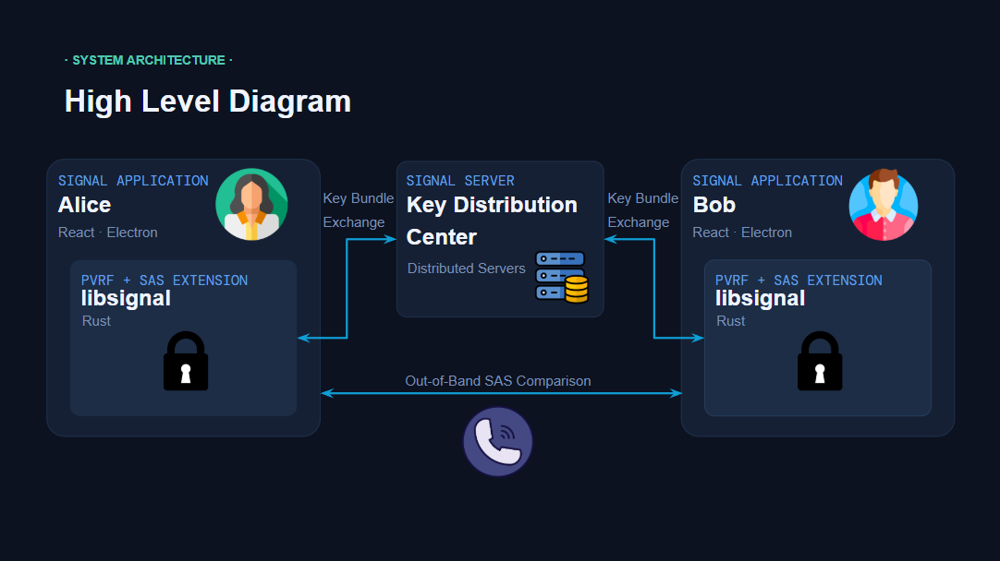

<!-- Copyright 2014 Signal Messenger, LLC -->
<!-- SPDX-License-Identifier: AGPL-3.0-only -->
# Deniable Authentication for Signal without Trust in the Key Distribution Server
## Overview
Modern secure messaging systems such as Signal provide strong confidentiality and authentication guarantees, but they rely on a trusted key distribution server to publish and manage long-term identity keys. While this model works well in practice, it introduces a central trust assumption: users must believe that the server behaves honestly and is not compromised, coerced, or malicious. In adversarial or high-risk environments, this assumption may be unacceptable. Our goal is to explore deniable authentication mechanisms that preserve privacy while maintaining security guarantees comparable to existing protocols.

To do this, our project leverages private Verifiable Random Functions (PVRFs) to enable SAS-based authentication while avoiding publicly verifiable signatures. This preserves the independence benefits of prior SAS-MA approaches, while maintaining the deniability properties that motivate X3DH’s adoption in modern messaging systems.

## Meet the Team
Phoenix Changkachith - Team Lead & Backend
Natasha Jha - Backend
Minh Dang -Frontend
Mary Hemker -Frontend

## Features
- 6-digit SAS verification code between users
- Integrated into the current Signal protocol
- Can optionally toggle SAS verification on or off
- 
## System Architecture

## Tech Stack
- React.js
- SQLite3
- Electron
- Rust
- TypeScript
## Setup Instructions
For Signal Desktop, instructions are included in the "Contributing" tab by the original Signal developers. For convenience, the most important steps are restated below.
### macOS

Install the [Xcode Command-Line Tools](http://osxdaily.com/2014/02/12/install-command-line-tools-mac-os-x/).

### Windows

1.  Download _Build Tools for Visual Studio 2022 Community Edition_ from [Microsoft's website](https://visualstudio.microsoft.com/vs/community/) and install it, including the "Desktop development with C++" option.
2.  Download and install the latest Python 3 release from https://www.python.org/downloads/windows/ (3.6 or later required).

### Linux

1.  Pick your favorite package manager.
1.  Install `python` (Python 3.6+)
1.  Install `gcc`
1.  Install `g++`
1.  Install `make`

### All platforms

Now, run these commands in your preferred terminal in a good directory for development:

```
git clone https://github.com/signalapp/Signal-Desktop.git
cd Signal-Desktop
npm install -g pnpm
pnpm install       # Install and build dependencies (this will take a while)
pnpm run generate  # Generate final JS and CSS assets
pnpm test          # A good idea to make sure tests run first
pnpm start         # Start Signal!
```

You'll need to restart the application regularly to see your changes, as there
is no automatic restart mechanism. Alternatively, keep the developer tools open
(`View > Toggle Developer Tools`), hover over them, and press
<kbd>Cmd</kbd> + <kbd>R</kbd> (macOS) or <kbd>Ctrl</kbd> + <kbd>R</kbd>
(Windows & Linux).

Also, note that the assets loaded by the application are not necessarily the same files
you’re touching. You may not see your changes until you run `pnpm run generate` on the
command-line like you did during setup. 

### The staging environment

Sadly, this default setup results in no contacts and no message history, an entirely
empty application. But you can use the information from your production install of Signal
Desktop to populate your testing application!

First, exit both production and development apps (In macOS - literally quit the apps).
Second, find your application data in the [appData](https://www.electronjs.org/docs/latest/api/app#appgetpathname) directory:

- macOS: `~/Library/Application Support/Signal`
- Linux: `~/.config/Signal`
- Windows 10: `C:\Users\<YourName>\AppData\Roaming\Signal`

Now make a copy of this production data directory in the same directory (a sibling of the Signal
directory), and call it `Signal-development`.

You will also need to go into the Signal-Desktop/config folder, and make a copy of the local-production.json file. Rename this copy to local-development.json.

Now start up the development version of the app as normal, link your Signal account,
and you'll see all of your contacts and messages!


### Linking libsignal
The previous steps set up the Signal Desktop development application, but the actual Rust protocol implementation is in the [libsignal repository](https://github.com/21pchangkachith/libsignal). Instructions for how to set up libsignal are included in the README for that repository.

#### ⚠️ Note:
From our research into Signal's setup instructions and code, it seems libsignal cannot be built on Windows, even though you can build Signal Desktop on Windows.

#### Link Setup
The following steps will show how to link the libsignal backend with the Signal Desktop application.

1. In the repo source folder, open the `package.json` file.
2. Search for "libsignal-client" and find the line that includes `"@signalapp/libsignal-client": "0.86.16` or similar.
3. Replace the version number with the path to your libsignal node (For example, `../libsignal/node`)
4. Save the changes and run `pnpm install` and `pnpm run build` to update

Signal runs on electron, which expects a different ABI path. This must be manually created.
- For macOS:
  - `mkdir -p prebuilds/darwin-arm64`
  - `cp build/Release/libsignal_client_darwin_arm64.node \
   prebuilds/darwin-arm64/electron.abi140.node`
   
- For Linux:
  - `mkdir -p prebuilds/linux-x64`
  - `cp build/Release/libsignal_client_linux_x64.node \
   prebuilds/linux-x64/electron.abi140.node`

After any changes, to make sure everything has updated correctly, run
```
pnpm run generate   # Or pnpm run build 
pnpm start
```

#### Known Setup issues

##### `yarn install` prints error 'Could not detect abi for version 30.0.6 and runtime electron'

`yarn install` may print an error like the following, but it can be ignored because the overall operation succeeds.

```
$ ./node_modules/.bin/electron-builder install-app-deps

  • electron-builder  version=24.6.3
  • loaded configuration  file=package.json ("build" field)
  • rebuilding native dependencies  dependencies=@nodert-win10-rs4/windows.data.xml.dom@0.4.4, @nodert-win10-rs4/windows.ui.notifications@0.4.4, @signalapp/better-sqlite3@8.7.1, @signalapp/windows-dummy-keystroke@1.0.0, bufferutil@4.0.7, fs-xattr@0.3.0, mac-screen-capture-permissions@2.0.0, utf-8-validate@5.0.10
                                    platform=linux
                                    arch=x64
  • install prebuilt binary  name=mac-screen-capture-permissions version=2.0.0 platform=linux arch=x64 napi=
  • build native dependency from sources  name=mac-screen-capture-permissions
                                          version=2.0.0
                                          platform=linux
                                          arch=x64
                                          napi=
                                          reason=prebuild-install failed with error (run with env DEBUG=electron-builder to get more information)
                                          error=/home/ben/sauce/Signal-Desktop/node_modules/node-abi/index.js:30
      throw new Error('Could not detect abi for version ' + target + ' and runtime ' + runtime + '.  Updating "node-abi" might help solve this issue if it is a new release of ' + runtime)
      ^

    Error: Could not detect abi for version 30.0.6 and runtime electron.  Updating "node-abi" might help solve this issue if it is a new release of electron
        at getAbi (/home/ben/sauce/Signal-Desktop/node_modules/node-abi/index.js:30:9)
        at module.exports (/home/ben/sauce/Signal-Desktop/node_modules/prebuild-install/rc.js:53:57)
        at Object.<anonymous> (/home/ben/sauce/Signal-Desktop/node_modules/prebuild-install/bin.js:8:25)
        at Module._compile (node:internal/modules/cjs/loader:1376:14)
        at Module._extensions..js (node:internal/modules/cjs/loader:1435:10)
        at Module.load (node:internal/modules/cjs/loader:1207:32)
        at Module._load (node:internal/modules/cjs/loader:1023:12)
        at Function.executeUserEntryPoint [as runMain] (node:internal/modules/run_main:135:12)
        at node:internal/main/run_main_module:28:49

    Node.js v20.11.1
```
## Testing

## Demo Video

## Known Issues/Future Work

## Thank you
This concludes the information pertaining to our MCS Capstone project and what features we have added. The original Signal-Desktop README is included below.

_______________________________________________

# Signal Desktop

Signal Desktop links with Signal on [Android](https://github.com/signalapp/Signal-Android) or [iOS](https://github.com/signalapp/Signal-iOS) and lets you message from your Windows, macOS, and Linux computers.

[Install the production version](https://signal.org/download/) or help us out by [installing the beta version](https://support.signal.org/hc/articles/360007318471-Signal-Beta).

## Got a question?

You can find answers to a number of frequently asked questions on our [support site](https://support.signal.org/).
The [community forum](https://community.signalusers.org/) is another good place for questions.

## Found a Bug?

Please search for any [existing issues](https://github.com/signalapp/Signal-Desktop/issues) that describe your bug in order to avoid duplicate submissions.

## Have a feature request, question, comment?

Please use our community forum: https://community.signalusers.org/

## Contributing Code

Please see [CONTRIBUTING.md](https://github.com/signalapp/Signal-Desktop/blob/main/CONTRIBUTING.md)
for setup instructions and guidelines for new contributors. Don't forget to sign the [CLA](https://signal.org/cla/).

## Contributing Funds

You can donate to Signal development through the [Signal Technology Foundation](https://signal.org/donate), an independent 501c3 nonprofit.

## Cryptography Notice

This distribution includes cryptographic software. The country in which you currently reside may have restrictions on the import, possession, use, and/or re-export to another country, of encryption software.
BEFORE using any encryption software, please check your country's laws, regulations and policies concerning the import, possession, or use, and re-export of encryption software, to see if this is permitted.
See <http://www.wassenaar.org/> for more information.

The U.S. Government Department of Commerce, Bureau of Industry and Security (BIS), has classified this software as Export Commodity Control Number (ECCN) 5D002.C.1, which includes information security software using or performing cryptographic functions with asymmetric algorithms.
The form and manner of this distribution makes it eligible for export under the License Exception ENC Technology Software Unrestricted (TSU) exception (see the BIS Export Administration Regulations, Section 740.13) for both object code and source code.

## License

Copyright 2013-2024 Signal Messenger, LLC

Licensed under the GNU AGPLv3: https://www.gnu.org/licenses/agpl-3.0.html
